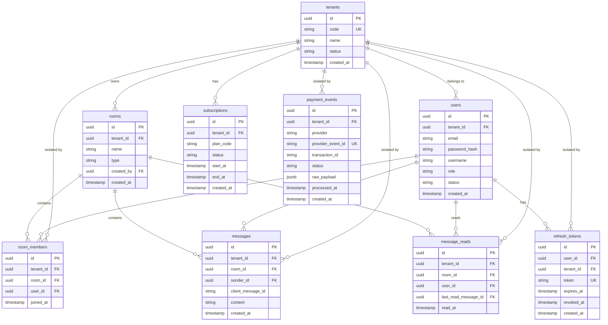

# ERD - Multi-Tenant Pro Chat App

## Entity Relationship Diagram

## Table Descriptions

### tenants
- **Purpose**: Multi-tenant isolation entity representing customer organizations
- **Key Fields**:
  - `code`: Unique slug/identifier for the tenant
  - `status`: active, inactive, suspended
- **Relationships**: One-to-many with all tenant-specific tables

### users
- **Purpose**: User accounts within a tenant
- **Key Fields**:
  - `password_hash`: Hashed password for authentication
  - `role`: admin, user
  - `status`: active, inactive
- **Relationships**: Belongs to a tenant, joins rooms, sends messages

### rooms
- **Purpose**: Chat rooms (1-1 direct or group)
- **Key Fields**:
  - `type`: direct, group
  - `created_by`: User who created the room
- **Relationships**: Owned by a tenant, contains members and messages

### room_members
- **Purpose**: Many-to-many relationship between users and rooms
- **Key Fields**:
  - `joined_at`: When user joined the room
- **Relationships**: Links users to rooms with tenant isolation

### messages
- **Purpose**: Chat messages
- **Key Fields**:
  - `client_message_id`: Client-generated ID for deduplication
  - Unique constraint: (tenant_id, room_id, client_message_id)
- **Relationships**: Sent by user, belongs to room and tenant

### message_reads
- **Purpose**: Track read receipts for messages
- **Key Fields**:
  - `last_read_message_id`: Last message user has read
  - `read_at`: When read status was updated
- **Relationships**: Links user to room with read status

### subscriptions
- **Purpose**: Tenant subscription plans
- **Key Fields**:
  - `plan_code`: basic, pro, enterprise
  - `start_at`, `end_at`: Subscription period
- **Relationships**: Belongs to tenant

### payment_events
- **Purpose**: Audit trail for payment webhooks
- **Key Fields**:
  - `provider_event_id`: Unique event ID from provider for idempotency
  - `raw_payload`: Original webhook payload
  - Unique constraint: (provider, provider_event_id)
- **Relationships**: Isolated by tenant

### refresh_tokens
- **Purpose**: JWT refresh token management
- **Key Fields**:
  - `token`: Refresh token string
  - `expires_at`: Token expiration (7 days)
  - `revoked_at`: When token was revoked
- **Relationships**: Belongs to user and tenant

## Indexes

- `idx_messages_room_created`: (room_id, created_at DESC) - For message ordering
- `idx_messages_tenant_room`: (tenant_id, room_id) - For tenant-scoped queries
- `idx_room_members_user`: (user_id) - For finding user's rooms
- `idx_room_members_tenant`: (tenant_id) - For tenant isolation
- `idx_message_reads_user_room`: (user_id, room_id) - For read status lookup
- `idx_message_reads_tenant`: (tenant_id) - For tenant isolation
- `idx_subscriptions_tenant`: (tenant_id) - For subscription lookup
- `idx_payment_events_provider`: (provider, provider_event_id) - For idempotency
- `idx_payment_events_tenant`: (tenant_id) - For tenant isolation
- `idx_refresh_tokens_user`: (user_id) - For user's tokens
- `idx_refresh_tokens_tenant`: (tenant_id) - For tenant isolation
- `idx_refresh_tokens_token`: (token) - For token lookup
- `idx_refresh_tokens_expires`: (expires_at) - For cleanup of expired tokens

## Row Level Security (RLS)

All tables have RLS enabled with tenant isolation policies:
- All queries automatically filter by `tenant_id` using `app.current_tenant` session variable
- Prevents cross-tenant data access
- Applied through JWT middleware that sets tenant context
