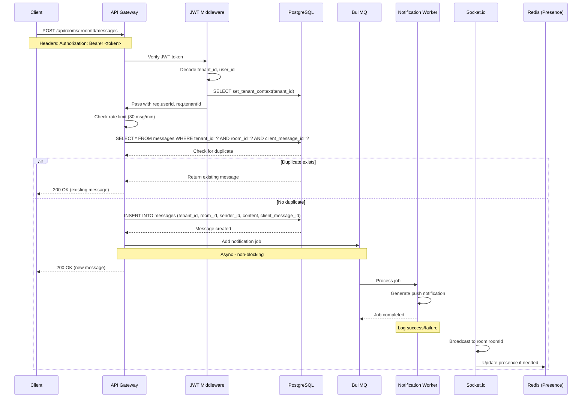
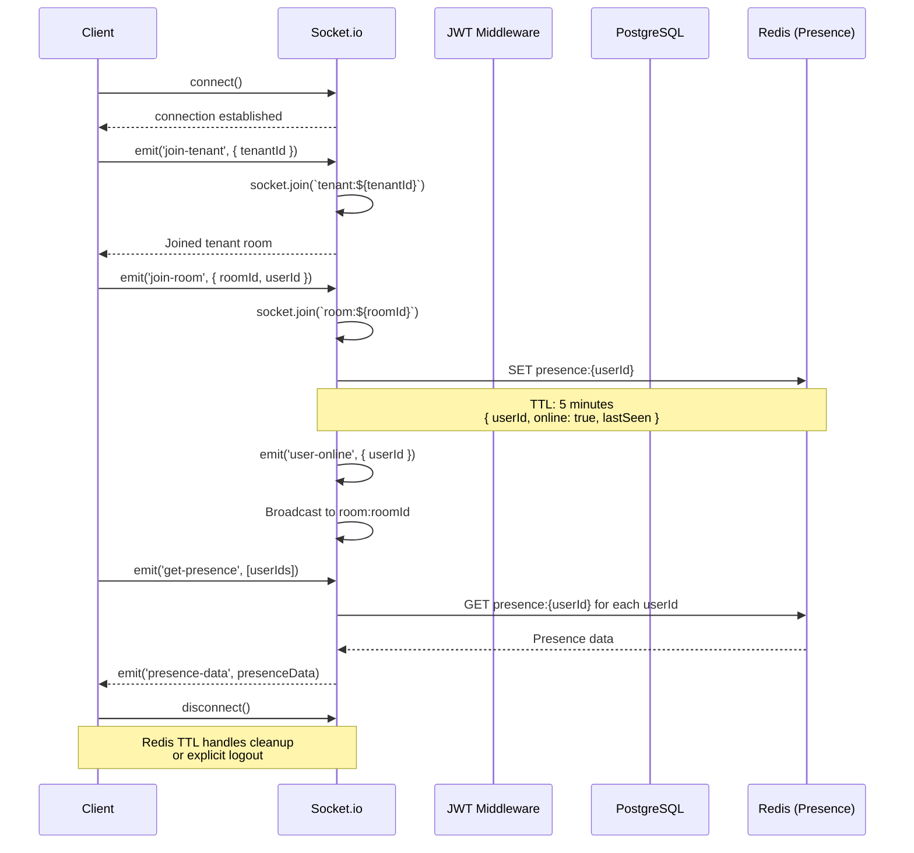
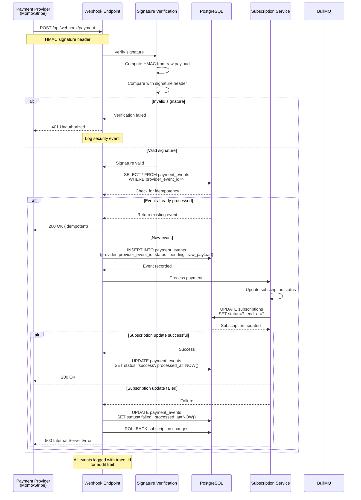

# Sequence Diagrams - Multi-Tenant Pro Chat App

## 1. Send Message Flow

## 2. WebSocket Join Room Flow

## 3. Payment Webhook Flow

## Flow Descriptions

### 1. Send Message Flow
- **Purpose**: Real-time message delivery with async notification
- **Key Features**:
  - JWT authentication with tenant context
  - Rate limiting (30 messages/minute)
  - Duplicate detection using client_message_id
  - Cursor-based pagination support
  - Async notification queue (BullMQ)
  - Socket.io broadcast to room members
  - Redis presence integration

### 2. WebSocket Join Room Flow
- **Purpose**: Real-time room membership and presence tracking
- **Key Features**:
  - Tenant-scoped socket rooms
  - Redis-based presence with TTL
  - Online/offline broadcasting
  - Presence query endpoint
  - Automatic cleanup via TTL

### 3. Payment Webhook Flow
- **Purpose**: Secure payment event processing with idempotency
- **Key Features**:
  - HMAC signature verification
  - Idempotency using provider_event_id
  - Transaction rollback on failure
  - Audit trail in payment_events table
  - Structured logging with trace_id
  - Tenant isolation for payment data
